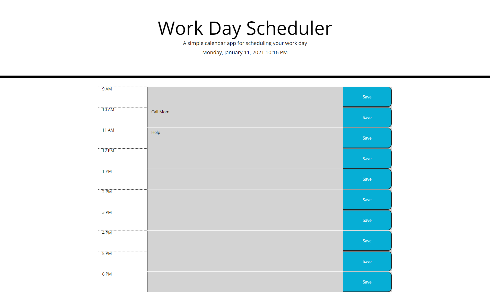

# Day-Planner

This Day Planner was created for those who have a busy schedule and want to be able to add their events to a planner. The user will enter the item into the text area and when they click the save button it will save the item. The planner is also color coded and will let the user know if the time is in the past, the present, or the future.

[You can view the planner here](https://danacorona.github.io/Day-Planner/)

# Screenshots

